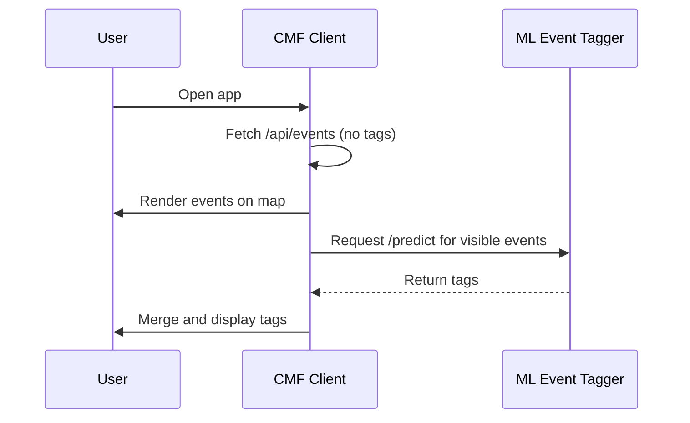

# 🧭 ML Event Tagger — Architecture Overview

This document outlines the design, data flow, and integration plan for the **ml-event-tagger** service.

---

## 🎯 Goal

Develop a minimal, well-structured machine learning microservice that can:

-   Train a lightweight text classifier using **TensorFlow/Keras**
-   Serve tag predictions via a **FastAPI** endpoint
-   Integrate with [CMF](https://github.com/chadn/cmf) or other event-based applications

---

## 🧱 System Overview

```
+------------------------+          +-----------------------+
|  CMF Client (Next.js)  |  --->    |  ML Event Tagger API  |
|  /api/events           |          |  /predict (FastAPI)   |
+------------------------+          +-----------------------+
         |                                     |
         |<------ Tags merged later -----------|
```

### Integration with CMF



---

## 🧩 Components

### 1️⃣ Training Pipeline

-   Located in `ml_event_tagger/train.py` and `notebooks/`.
-   Reads labeled data (`data/labeled_events.json`).
-   Preprocesses text: concatenates `name + description + location`
-   Uses Tokenizer + Sequential Keras model:
    -   Embedding → GlobalAveragePooling1D → Dense(32, relu) → Dense(n_tags, sigmoid)
-   Data split: 70% train / 15% validation / 15% test
-   Produces:
    -   `models/tagger_v1_YYYYMMDD.h5` (model weights)
    -   `models/tokenizer_v1.pkl` (tokenizer)
    -   `models/metrics_v1.json` (evaluation results)
-   Evaluates: precision, recall, F1-score per tag, confusion matrix

**Model versioning:** Models saved with version and date, allowing regression tests and performance comparison.

### 2️⃣ Serving Layer

-   FastAPI app (`ml_event_tagger/serve.py`).
-   Loads pre-trained model and tokenizer at startup.
-   Exposes endpoints:
    -   `GET /health` - Health check
    -   `POST /predict` - Tag prediction
-   Returns top-5 tags with confidence scores per event.

### 3️⃣ Data & Tags

-   **Static labeled dataset** in MVP (~100 events from CMF)
-   **Tag taxonomy:** 15-20 predefined tags (see [TAGS.md](./TAGS.md))
-   Future: adapters for live event fetching from multiple sources

---

## ⚙️ Data Flow

### Training Phase

1. Load labeled events from `data/labeled_events.json`
2. Preprocess text:
    - Concatenate: `name + " " + description + " " + location`
    - Lowercase, remove URLs, strip HTML tags
    - Tokenize with max sequence length
3. Split data: 70% train / 15% validation / 15% test
4. Train multi-label classifier
5. Evaluate on test set
6. Save model, tokenizer, and metrics

### Inference Phase

1. Client sends events via `/predict` endpoint
2. Preprocess text (same pipeline as training)
3. Tokenize and pad sequences
4. Model predicts tag probabilities
5. Return top-5 tags sorted by confidence

---

## 🧩 API Contract

### POST /predict

**Request:**

```json
{
    "events": [
        {
            "name": "Days Like This - House Music",
            "description": "Weekly house music gathering with local DJs",
            "location": "The Pergola at Lake Merritt, 599 El Embarcadero, Oakland, CA 94610, USA"
        }
    ]
}
```

**Response:**

```json
{
    "predictions": [
        {
            "tags": [
                { "name": "music", "confidence": 0.92 },
                { "name": "house", "confidence": 0.87 },
                { "name": "oakland", "confidence": 0.86 },
                { "name": "dance", "confidence": 0.78 },
                { "name": "weekly", "confidence": 0.65 }
            ]
        }
    ]
}
```

**Notes:**

-   `location` is optional but recommended for better predictions
-   Returns top-5 tags sorted by confidence (descending)
-   Confidence values are between 0.0 and 1.0

### GET /health

**Response:**

```json
{
    "status": "healthy",
    "model_loaded": true,
    "version": "0.1.0"
}
```

---

## 🚀 Integration with CMF

**Client-side enrichment (recommended MVP):**

-   CMF loads map events instantly.
-   Background task calls `/predict` for all visible events.
-   Updates UI with suggested tags once received.

**Alternative (later):**

-   CMF backend `/api/events` merges tags server-side and caches results.

---

## 📊 Training Strategy

### Model Architecture

```
Input (text sequences)
    ↓
Embedding(vocab_size=5000, embedding_dim=64)
    ↓
GlobalAveragePooling1D()
    ↓
Dense(32, activation='relu')
    ↓
Dense(n_tags, activation='sigmoid')
```

### Hyperparameters

-   **Vocabulary size:** 5000 tokens
-   **Embedding dimension:** 64
-   **Max sequence length:** 100 tokens
-   **Dense layer size:** 32 neurons
-   **Batch size:** 16
-   **Epochs:** 20-30 (with early stopping)
-   **Optimizer:** Adam (lr=0.001)
-   **Loss:** Binary crossentropy

### Evaluation Metrics

**Primary metrics:**

-   Macro-averaged precision (≥60% target)
-   Macro-averaged recall (≥40% target)
-   Per-tag precision and recall

**Visualizations:**

-   Confusion matrix heatmap
-   Tag frequency distribution
-   Precision/Recall bar charts per tag
-   Training/validation loss curves

---

## 🧱 Repository Structure

```
ml-event-tagger/
├── ml_event_tagger/           # Main package
│   ├── __init__.py
│   ├── train.py               # Training script
│   ├── serve.py               # FastAPI app
│   ├── preprocess.py          # Text preprocessing
│   ├── model.py               # Model architecture
│   └── config.py              # Configuration
├── notebooks/
│   └── 01_train_and_evaluate.ipynb
├── models/                     # Saved models (gitignored)
├── data/
│   └── labeled_events.json
├── tests/
│   └── test_api.py
├── docs/
│   ├── ARCHITECTURE.md         # This file
│   ├── ROADMAP.md
│   ├── MVP_DECISIONS.md
│   ├── IMPLEMENTATION_PLAN.md
│   ├── TAGS.md
│   └── VERSION_MANAGEMENT.md
├── pyproject.toml              # Dependencies & project config
├── requirements.txt            # Legacy (kept for compatibility)
├── CHANGELOG.md
├── Dockerfile
├── .gitignore
└── README.md
```

---

## 🧰 Deployment Plan

**MVP Deployment:**

-   Dockerfile with Python 3.11+ slim image
-   FastAPI with Uvicorn server
-   Expose port 8080
-   Deploy to Render.com (preferred) Fly.io, or Hugging Face Spaces

---

## ✅ Success Criteria

-   **Model Performance:** ≥60% macro-averaged precision on test data
-   **System Performance:** <300ms inference time (p95 latency)
-   **End-to-End:** Working pipeline from training to serving
-   **Reproducibility:** Clone to first prediction in ~10 minutes
-   **Code Quality:** Clean, documented, testable code
