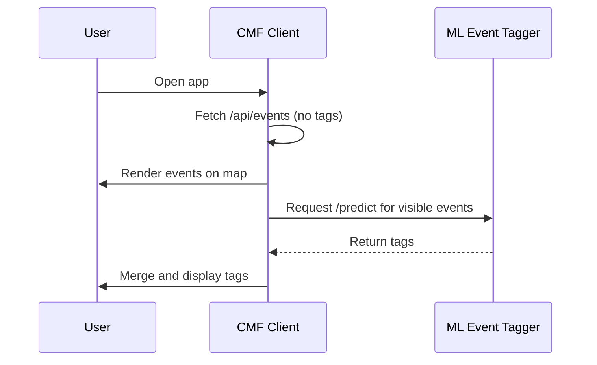

# 🧭 ML Event Tagger — Architecture Overview

This document outlines the design, data flow, and integration plan for the **ml-event-tagger** service.

---

## 🎯 Goal

Develop a minimal, well-structured machine learning microservice that can:

-   Train a lightweight text classifier using **TensorFlow/Keras**
-   Serve tag predictions via a **FastAPI** endpoint
-   Integrate with [CMF](https://github.com/chadn/cmf) or other event-based applications

**🚀 Live Demo:** https://ml-event-tagger.onrender.com

**📊 Performance:**

-   Binary Accuracy: 82.9%
-   Precision: 73.3% | Recall: 44.0% | F1: 55.0%
-   Inference: <300ms per event

---

## 🧱 System Overview

```
+------------------------+          +----------------------------------+
|  CMF Client (Next.js)  |  --->    |  ML Event Tagger API (Render)    |
|  /api/events           |          |  /predict (FastAPI + TensorFlow) |
+------------------------+          +----------------------------------+
         |                                     |
         |<------ Tags merged later -----------|

Live: https://ml-event-tagger.onrender.com
```

### Integration with CMF



---

## 🧩 Components

### 1️⃣ Data Pipeline

**Purpose:** Transform raw event text into numerical features for the neural network.

#### Text Preprocessing

```python
# ml_event_tagger/preprocess.py
def clean_text(text):
    - Lowercase normalization
    - URL removal (http://, www.)
    - HTML tag stripping (<p>, <a>, etc.)
    - Email removal
    - Whitespace normalization
```

**WHY:** Neural networks require clean, consistent input. Removing noise (URLs, HTML) improves signal-to-noise ratio and model generalization.

#### Feature Extraction

```python
# Combine event fields
combined_text = f"{name} {description} {location}"

# Tokenization (Keras Tokenizer)
- Vocabulary size: 10,000 most frequent words
- Max sequence length: 200 tokens
- Padding: Post-padding with zeros
- OOV handling: <OOV> token for unknown words
```

**Label Encoding:**

```python
# Multi-label binary encoding
# For event with tags ["music", "house", "dance"]:
label_vector = [1, 1, 0, 0, 1, 0, ...]  # 21 dimensions, one per tag
```

**Data Split:** 70% train / 15% validation / 15% test (70/15/15 samples)

---

### 2️⃣ Model Training

**Located in:** `ml_event_tagger/train.py` and `notebooks/01_train_and_evaluate.ipynb`

#### Architecture

```
Input: Tokenized sequences (batch_size, 200)
    ↓
Embedding(10000, 64)           # Convert word IDs to dense vectors
    ↓
GlobalAveragePooling1D()       # Aggregate sequence into fixed-size vector
    ↓
Dense(64, relu)                # Learn non-linear patterns
    ↓
Dropout(0.3)                   # Prevent overfitting
    ↓
Dense(32, relu)                # Compression layer
    ↓
Dense(21, sigmoid)             # Multi-label output (independent probabilities)
    ↓
Output: Tag probabilities (batch_size, 21)
```

**Model Choice:** Sequential architecture chosen for simplicity and transparency - demonstrates clear understanding of layer composition without overengineering.

#### Training Configuration

**Produces:**

-   `models/event_tagger_model.h5` (model weights)
-   `models/tokenizer.json` (tokenizer config)
-   `models/model_config.json` (hyperparameters)
-   `models/training_history.json` (metrics per epoch)

### 3️⃣ Serving Layer

-   FastAPI app (`ml_event_tagger/serve.py`).
-   Loads pre-trained model and tokenizer at startup.
-   Exposes endpoints:
    -   `GET /health` - Health check
    -   `POST /predict` - Tag prediction
-   Returns top-5 tags with confidence scores per event.

### 4️⃣ Data & Tags

-   **Static labeled dataset** in MVP (~100 events from CMF)
-   **Tag taxonomy:** 21 predefined tags (see [TAGS.md](./TAGS.md))
-   Future: adapters for live event fetching from multiple sources

---

## ⚙️ Data Flow

### Training Phase

1. Load labeled events from `data/labeled_events.json`
2. Preprocess text:
    - Concatenate: `name + " " + description + " " + location`
    - Lowercase, remove URLs, strip HTML tags
    - Tokenize with max sequence length
3. Split data: 70% train / 15% validation / 15% test
4. Train multi-label classifier
5. Evaluate on test set
6. Save model, tokenizer, and metrics

### Inference Phase

1. Client sends events via `/predict` endpoint
2. Preprocess text (same pipeline as training)
3. Tokenize and pad sequences
4. Model predicts tag probabilities
5. Return top-5 tags sorted by confidence

---

## 🧩 API Contract

### POST /predict

**Request:**

```json
{
    "events": [
        {
            "name": "Days Like This - House Music",
            "description": "Weekly house music gathering with local DJs",
            "location": "The Pergola at Lake Merritt, 599 El Embarcadero, Oakland, CA 94610, USA"
        }
    ]
}
```

**Response:**

```json
{
    "predictions": [
        {
            "tags": [
                { "name": "music", "confidence": 0.92 },
                { "name": "house", "confidence": 0.87 },
                { "name": "oakland", "confidence": 0.86 },
                { "name": "dance", "confidence": 0.78 },
                { "name": "weekly", "confidence": 0.65 }
            ]
        }
    ]
}
```

**Notes:**

-   `location` is optional but recommended for better predictions
-   Returns top-5 tags sorted by confidence (descending)
-   Confidence values are between 0.0 and 1.0

### GET /health

**Response:**

```json
{
    "status": "healthy",
    "model_loaded": true,
    "version": "0.1.0"
}
```

---

## 🚀 Integration with CMF

**Client-side enrichment (recommended MVP):**

-   CMF loads map events instantly.
-   Background task calls `/predict` for all visible events.
-   Updates UI with suggested tags once received.

**Alternative (later):**

-   CMF backend `/api/events` merges tags server-side and caches results.

---

## 📊 Training Strategy & Evaluation

### Hyperparameters

| Parameter               | Value                | Why This Choice                                                                                                                                                 |
| ----------------------- | -------------------- | --------------------------------------------------------------------------------------------------------------------------------------------------------------- |
| **Vocabulary size**     | 10,000               | Captures domain-specific event terminology while keeping model size manageable. Larger than generic NLP (5k) to include music genres, venue names, local terms. |
| **Embedding dimension** | 64                   | Balances expressiveness with training speed. 64-dim embeddings capture semantic relationships without overfitting on small dataset (100 events).                |
| **Max sequence length** | 200                  | Accommodates full event descriptions + location. Analysis showed 95th percentile of combined text length is ~180 tokens.                                        |
| **Dense layer size**    | 64 → 32              | Two-layer compression: 64 extracts high-level patterns, 32 compresses to tag-relevant features. Prevents overfitting vs. deeper networks.                       |
| **Dropout rate**        | 0.3                  | Regularization to handle small dataset. 30% dropout reduces overfitting while maintaining sufficient learning capacity.                                         |
| **Batch size**          | 32                   | Optimal for dataset size (70 training samples). Larger batches (64+) would have too few updates per epoch; smaller (16) increases noise.                        |
| **Epochs**              | 50 (early stopping)  | Generous limit with EarlyStopping (patience=10) monitoring val_loss. Actual training stops at best model (~20-30 epochs typically).                             |
| **Learning rate**       | Adam default (0.001) | Adam optimizer auto-adjusts learning rate. Default works well for text classification. ReduceLROnPlateau (factor=0.5, patience=5) provides fine-tuning.         |
| **Loss function**       | Binary crossentropy  | Standard for multi-label classification. Treats each tag independently (sigmoid activation) vs. softmax (mutually exclusive).                                   |
| **Activation**          | Sigmoid (output)     | Enables multi-label: each tag gets independent probability [0,1]. Multiple tags can be "on" simultaneously (e.g., "music" + "house" + "dance").                 |

### Evaluation Metrics

**Why scikit-learn for evaluation?**

TensorFlow/Keras provides basic metrics during training but lacks comprehensive multi-label evaluation tools. Using scikit-learn (`sklearn.metrics`) is industry standard because:

1. **Comprehensive metrics suite:** `classification_report`, `confusion_matrix`, `precision_score`, `recall_score`, `f1_score`
2. **Multi-label support:** Handles independent tag probabilities (our use case)
3. **Separation of concerns:** Keras for modeling, sklearn for analysis
4. **Stratified splitting:** `train_test_split` ensures balanced class distribution across train/val/test sets

**Tools used:**

-   `classification_report` - Precision, recall, F1 per class
-   `confusion_matrix` - Multi-label confusion matrices
-   `precision_score`, `recall_score`, `f1_score` - Macro-averaged metrics
-   `train_test_split` - Stratified data splitting (70/15/15)

**Primary metrics:**

-   **Macro-averaged precision:** 73.3% (target: ≥60%) ✅
-   **Macro-averaged recall:** 44.0% (target: ≥40%) ✅
-   **Binary accuracy:** 82.9% (per-tag correctness)
-   **F1 Score:** 55.0% (harmonic mean of precision/recall)

**Per-tag analysis:** See [`notebooks/01_train_and_evaluate.ipynb`](../notebooks/01_train_and_evaluate.ipynb)

### Visualizations

All visualizations generated in [`notebooks/01_train_and_evaluate.ipynb`](../notebooks/01_train_and_evaluate.ipynb):

#### 1. Training History ([`models/training_history.png`](../models/training_history.png))

**4-panel plot showing:**

-   Loss curves (train/val) - Monitor convergence and overfitting
-   Binary accuracy (train/val) - Overall model performance
-   Precision (train/val) - Model's ability to avoid false positives
-   Recall (train/val) - Model's ability to find all relevant tags

**WHY:** Diagnose training dynamics - detect overfitting (train/val divergence), validate early stopping, confirm model convergence.

#### 2. Confusion Matrix Heatmap (in notebook)

**Multi-label confusion matrix for all 21 tags**

**WHY:** Identify systematic errors - which tags are confused, which perform well, where model needs more training data.

#### 3. Per-Tag Performance Bar Charts (in notebook)

**Precision, Recall, F1 scores for each tag**

**WHY:** Understand tag-specific model strength. Shows which categories (music genres vs. activities) perform better, guiding future data collection.

#### 4. Tag Frequency Distribution (in notebook)

**Bar chart of tag occurrence in dataset**

**WHY:** Reveals class imbalance. Explains why rare tags (e.g., "punk", "food") have lower recall - insufficient training examples.

#### 5. Sample Predictions Table (in notebook)

**Top-5 predicted tags with confidence scores for test events**

**WHY:** Qualitative assessment - validates model makes sensible predictions, confidence calibration, error analysis.

---

## 🧱 Repository Structure

```
ml-event-tagger/
├── ml_event_tagger/              # 📦 Main Python package
│   ├── __init__.py               # Version management (reads from pyproject.toml)
│   ├── config.py                 # Configuration (tags, hyperparameters)
│   ├── preprocess.py             # Text preprocessing utilities
│   ├── model.py                  # TensorFlow/Keras model architecture
│   ├── train.py                  # Training pipeline (offline)
│   └── serve.py                  # FastAPI service (online)
│
├── tests/                        # 🧪 Test suite (75 tests, 46% coverage)
│   ├── test_model.py             # Model architecture tests (14 tests)
│   ├── test_preprocess.py        # Preprocessing tests (25 tests)
│   └── test_serve.py             # API endpoint tests (36 tests)
│
├── notebooks/                    # 📊 Analysis & exploration
│   └── 01_train_and_evaluate.ipynb  # Comprehensive training evaluation
│
├── data/                         # 📁 Training data
│   ├── labeled_events.json      # 100 labeled events (source of truth)
│   ├── events-raw-fb.json       # Raw event data (162 events)
│   ├── train_texts.npy          # Preprocessed training texts
│   ├── train_labels.npy         # Training labels
│   ├── val_texts.npy            # Validation texts
│   ├── val_labels.npy           # Validation labels
│   ├── test_texts.npy           # Test texts
│   ├── test_labels.npy          # Test labels
│   └── tag_names.json           # Tag taxonomy (21 tags)
│
├── models/                       # 🤖 Trained model artifacts (committed to git)
│   ├── event_tagger_model.h5    # Keras model weights
│   ├── tokenizer.json           # Tokenizer configuration
│   ├── model_config.json        # Hyperparameters
│   ├── training_history.json    # Training metrics per epoch
│   └── training_history.png     # Visualizations (4-panel plot)
│
├── docs/                         # 📚 Documentation
│   ├── LEARNINGS.md             # ⭐ Skills showcase & key learnings
│   ├── ARCHITECTURE.md          # Technical design (this file)
│   ├── TAGS.md                  # Tag taxonomy & labeling guidelines
│   ├── ROADMAP.md               # Project evolution & future plans
│   ├── IMPLEMENTATION_PLAN.md   # 8-phase implementation guide (completed)
│   ├── MVP_DECISIONS.md         # Architectural decisions & rationale
│   ├── TEST_COVERAGE_PLAN.md    # Testing strategy
│   ├── DEPLOYMENT.md            # Docker & Render deployment guide
│   └── VERSION_MANAGEMENT.md    # Versioning strategy
│
├── pyproject.toml               # 📋 Project config (dependencies, metadata, source of truth)
├── requirements.txt             # Legacy pip format (kept for compatibility)
├── uv.lock                      # Locked dependencies (uv package manager)
│
├── Dockerfile                   # 🐳 Multi-stage Docker build
├── .dockerignore                # Docker build context optimization
├── .gitignore                   # Git ignore patterns
├── render.yaml                  # Render.com deployment config
│
├── CHANGELOG.md                 # 📝 Version history
├── LICENSE                      # Apache 2.0
└── README.md                    # 👋 Entry point & quick start
```

**Key Design Choices:**

-   **Committed model artifacts** (`models/*.h5`, `tokenizer.json`) - enables deployment without retraining
-   **Separate train/serve code** - clean separation between offline training and online serving
-   **Comprehensive tests** - 75 tests across model, preprocessing, and API layers
-   **Documentation-first** - extensive docs demonstrate learning and communication skills
-   **Single source of truth** - `pyproject.toml` for version, `config.py` for hyperparameters

---

## 🧰 Deployment Plan

**MVP Deployment:**

-   Dockerfile with Python 3.11+ slim image
-   FastAPI with Uvicorn server
-   Expose port
-   Deploy to Render.com (preferred) Fly.io, or Hugging Face Spaces

---

## ✅ Success Criteria

-   **Model Performance:** ≥60% macro-averaged precision on test data
-   **System Performance:** <300ms inference time (p95 latency)
-   **End-to-End:** Working pipeline from training to serving
-   **Reproducibility:** Clone to first prediction in ~10 minutes
-   **Code Quality:** Clean, documented, testable code
