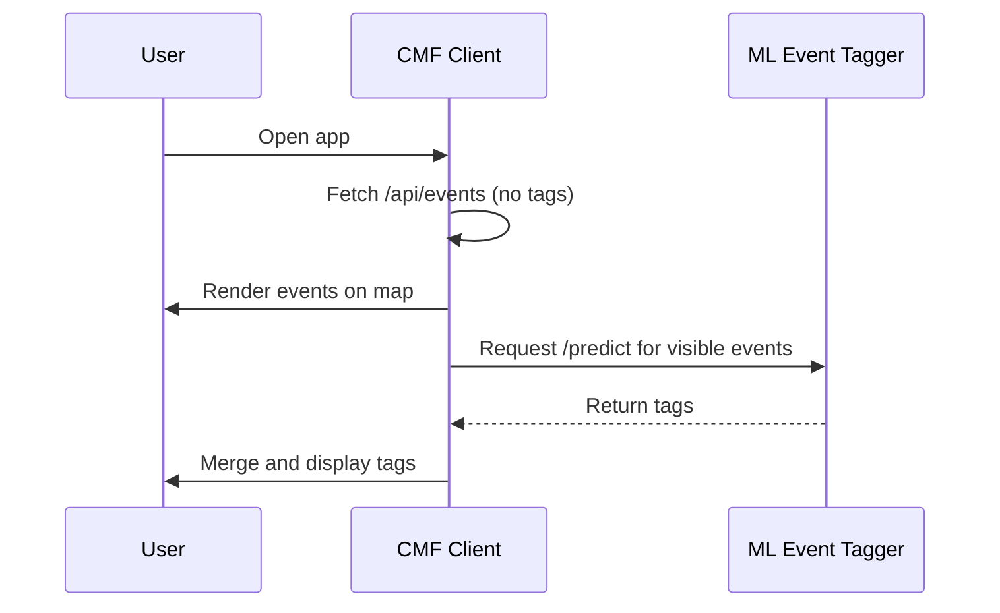

# 🧭 ML Event Tagger — Architecture Overview

This document outlines the design, data flow, and integration plan for the **ml-event-tagger** service.

---

## 🎯 Goal

Develop a minimal, well-structured machine learning microservice that can:

-   Train a lightweight text classifier using **TensorFlow/Keras**
-   Serve tag predictions via a **FastAPI** endpoint
-   Integrate with [CMF](https://github.com/chadn/cmf) or other event-based applications

---

## 🧱 System Overview

```
+------------------------+          +-----------------------+
|  CMF Client (Next.js)  |  --->    |  ML Event Tagger API  |
|  /api/events           |          |  /predict (FastAPI)   |
+------------------------+          +-----------------------+
         |                                     |
         |<------ Tags merged later -----------|
```

### Integration with CMF



---

## 🧩 Components

### 1️⃣ Training Pipeline

-   Located in `core/train.py` or `notebooks/`.
-   Reads labeled data (`data/labeled_events.json`).
-   Uses Tokenizer + Sequential Keras model:
    -   Embedding → GlobalAveragePooling → Dense(32, relu) → Dense(n_tags, sigmoid)
-   Produces:
    -   `models/tagger.v1.h5` (model weights)
    -   `models/tagger.v2.h5` (model weights)
    -   `models/tokenizer.pkl` (tokenizer)
-   Evaluates precision, recall, and ROC curves.

Note Models saved as models/tagger.v1.h5, models/tagger.v2.h5, etc., allowing regression tests and performance comparison.

### 2️⃣ Serving Layer

-   FastAPI app (`core/serve.py`).
-   Loads pre-trained model and tokenizer.
-   Exposes `/predict`:
    ```json
    { "events": [{ "name": "string", "description": "string", "location": "string" }] }
    ```
-   Returns top-N tags with confidence scores.

### 3️⃣ Data Sources

-   **Static dataset** in MVP (snapshot from CMF).
-   Future: live fetch adapter (`adapters/cmf/fetch_events.py`).
-   Design supports additional adapters (e.g., `adapters/eventbrite/`) to fetch and preprocess data from other event sources.

---

## ⚙️ Data Flow

1. **Training Phase**
    - Pull events from CMF or local JSON.
    - Preprocess: lowercase, remove URLs, concatenate fields.
    - Tokenize and fit model.
    - Save trained weights.

Note: Training data originates from CMF’s /api/events endpoint as of YYYY-MM-DD.
For reproducibility, this version will be stored in /data/raw-events.json.

2. **Inference Phase**
    - Client sends event text.
    - Service preprocesses, tokenizes, predicts tags.
    - Returns sorted tags by confidence.

---

## 🧩 API Contract

### Request

```json
{
    "events": [
        {
            "name": "Days Like This - House Music",
            "description": "https://www.instagram.com/dayslikethis.oakland/ \"Days Like This\" crew overlaps with \"About The Music\" crew (DJ Jason Kincaid and Eric Cooper)",
            "location": "The Pergola at Lake Merritt, 599 El Embarcadero, Oakland, CA 94610, USA", // from source
            "formatted_address": "599 El Embarcadero, Oakland, CA 94610, USA", // from google maps geocoding api
            "types": [ // from google maps geocoding api
              "establishment",
              "point_of_interest",
              "tourist_attraction"
            ],
        }
    ]
}

```

### Response

```json
{
    "tags": [
        {
            "event_index": 0,
            "tags": [
                { "name": "music", "confidence": 0.92 },
                { "name": "oakland", "confidence": 0.86 }
            ]
        }
    ]
}
```

---

## 🚀 Integration with CMF

**Client-side enrichment (recommended MVP):**

-   CMF loads map events instantly.
-   Background task calls `/predict` for all visible events.
-   Updates UI with suggested tags once received.

**Alternative (later):**

-   CMF backend `/api/events` merges tags server-side and caches results.

---

## 🧠 Caching Strategy

-   MVP: none (predict on demand)
-   Future: cache tags keyed by event `id` or text hash
-   Optional: Redis or Supabase table for persistence

---

## 📊 Evaluation Plan

Metrics to track:

-   Precision@3
-   Recall@3
-   Tag frequency balance
-   Confusion matrix (optional)

---

## 🔒 Access Control

-   Simple header-based API key authentication.
-   Environment variable: `ML_API_KEY`.
-   Client must include `x-api-key` header in all requests.

---

## 🧰 Deployment Plan

-   Host on Render.com, Fly.io, or Hugging Face Spaces.
-   Use Dockerfile for consistent build.
-   Expose port 8080.

---

## 🧱 Future Improvements

-   Larger labeled dataset
-   Automated labeling heuristics
-   TF-Hub embedding models
-   Human feedback retraining loop
-   TensorFlow.js export for in-browser inference
-   Visualization dashboard for tag stats

---

## ✅ Success Criteria

-   Model achieves ≥70% precision on validation data.
-   Tags are contextually relevant.
-   Inference under 300ms per event.
-   Clear training/serving separation.
