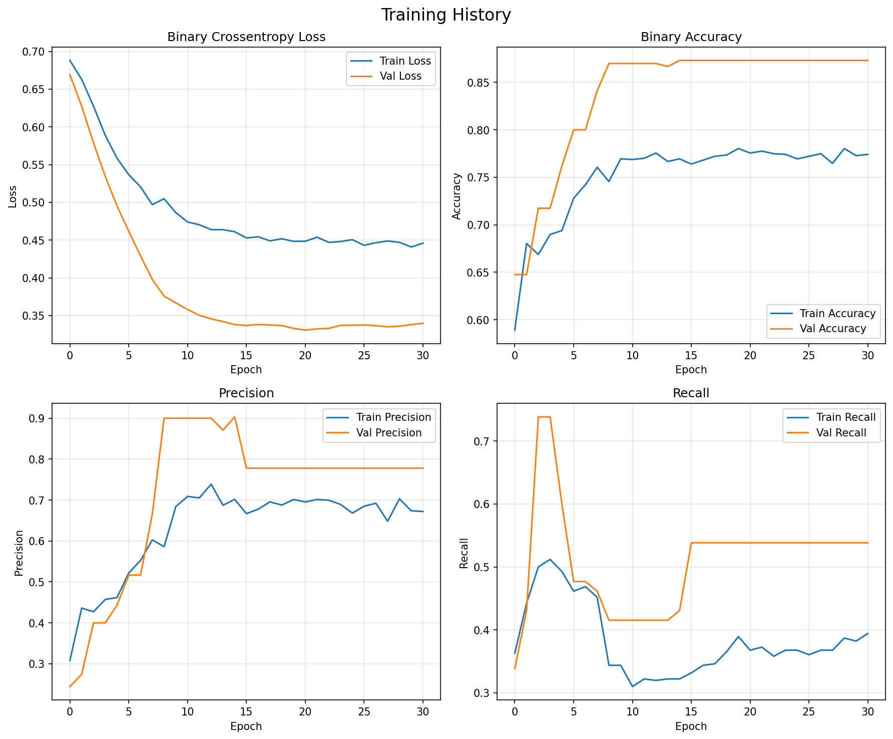

# 📚 ML Event Tagger — Key Learnings & Demonstrated Skills

This document summarizes the machine learning engineering skills and architectural decisions demonstrated in this project.

---

## 🎯 Project Overview

**Challenge:** Build a production-ready ML microservice that tags events with relevant categories using only their text descriptions.

**Solution:** Multi-label text classification using TensorFlow/Keras, served via FastAPI, deployed on Render.com.

**Key Achievement:** From raw text to deployed API in a clean, reproducible pipeline.

---

## 🧠 Machine Learning Learnings

### 1. Data Pipeline Design

**What:** Transform unstructured text from events into neural network inputs.

**Skills Demonstrated:**

-   Text preprocessing (lowercasing, URL removal, HTML stripping)
-   Feature engineering (combining name + description + location)
-   Tokenization with vocabulary management (10k most frequent words)
-   Sequence padding/truncation (fixed length: 200 tokens)
-   Multi-label binary encoding (21-dimensional output vectors)

**Key Decision (Novice):** Chose to combine all three fields (name+desc+location) rather than just name+description. More context = better predictions.

**Key Insight (Learned):** Clean, consistent preprocessing is critical. Removing noise (URLs, HTML tags) improves signal-to-noise ratio.

**Tools:** Custom preprocessing + Keras Tokenizer + scikit-learn ([why sklearn?](ARCHITECTURE.md#evaluation-metrics))

---

### 2. Model Architecture Selection

**What:** Design a neural network for multi-label text classification.

**Architecture Chosen:**

```
Embedding(10k vocab, 64-dim) → GlobalAveragePooling1D()
  → Dense(64, relu) → Dropout(0.3) → Dense(32, relu)
  → Dense(21, sigmoid)
```

**Skills Demonstrated:**

-   **Embedding layer:** Convert discrete word IDs to dense semantic vectors
-   **Pooling strategy:** GlobalAveragePooling aggregates variable-length sequences
-   **Dense layers:** Extract hierarchical features (64→32 compression)
-   **Dropout:** Regularization to prevent overfitting on small dataset
-   **Sigmoid activation:** Enable multi-label output (vs. softmax for single-label)

**Key Decision (Novice):** **Keep it simple** - chose Sequential model over LSTM/Transformers, sequential architecture provides transparency and debuggability. With only 100 events, complex models would overfit, simpler model trains faster, generalizes better on small data (100 events).

**Key Decision (Novice):** Chose GlobalAveragePooling over LSTM/GRU because:

-   ✅ Faster training (no recurrence) - good for learning/iteration
-   ✅ Simpler to understand and debug
-   ✅ Sufficient for categorization (don't need word order)
-   ❌ Trade-off: Loses sequential information (acceptable for this use case)

**What's Standard Practice (Followed):**

-   Embedding layer for text (standard for NLP)
-   Sigmoid activation for multi-label (vs softmax for single-label)
-   Dropout for regularization (standard technique)

---

### 3. Hyperparameter Tuning

**Key Decisions (Novice):**

-   **Dataset size (100 events):** Practical constraint - manually labeled what was feasible
-   **Sequence length (200):** Data-driven - analyzed my data, found 95th percentile ~180 tokens
-   **Keep it simple:** Avoided deep networks (5+ layers) to prevent overfitting on small dataset

**What's Standard Practice (Followed):**

-   **Vocabulary size (10k):** Common for domain-specific NLP (tutorials suggest 5k-20k range)
-   **Embedding dim (64):** Standard for small datasets (tutorials suggest 32-128)
-   **Batch size (32):** Formula-based - datasets <1000 samples typically use 16-64
-   **Adam optimizer:** Industry default (no reason to change for first model)
-   **Early stopping + ReduceLROnPlateau:** Standard callbacks from Keras documentation
-   **Binary crossentropy + sigmoid:** Standard for multi-label classification

**Key Learning:** Most hyperparameters have established ranges. As a novice, following best practices is smart - don't reinvent the wheel.

**Validation Strategy:** 70/15/15 split provides enough validation data (15 samples) to detect overfitting while maximizing training data.

---

### 4. Training Process

**What's Standard Practice (Followed):**

-   **Loss function:** Binary crossentropy (standard for multi-label from docs)
-   **Callbacks:** EarlyStopping + ReduceLROnPlateau (followed Keras examples)
-   **Metrics:** Binary accuracy, precision, recall (built into Keras)
-   **Checkpointing:** Save best model (standard practice from tutorials)

**Key Learning:** With 100 events, the model converged in ~20-30 epochs. Early stopping (patience=10) caught this automatically - no manual intervention needed.

**Tools:** TensorFlow/Keras for training loop, callbacks for automation

---

### 5. Model Evaluation

**Skills Demonstrated:**

-   **Metrics:** Precision (73.3%), Recall (44.0%), F1 (55.0%), Binary Accuracy (82.9%)
-   **Per-tag analysis:** Identify strongest/weakest categories
-   **Confusion matrix:** Multi-label confusion matrices for all 21 tags
-   **Visualization:** Training curves, tag distributions, sample predictions

**What's Standard Practice (Followed):**

-   Using scikit-learn for evaluation (see [ARCHITECTURE.md - Why scikit-learn?](ARCHITECTURE.md#evaluation-metrics))
-   Macro-averaged metrics (equal weight per class - standard for imbalanced data)
-   Confusion matrices (standard diagnostic tool)

**Key Learning:** High precision (73%) but lower recall (44%) means the model is **conservative** - it's confident when it predicts, but misses some correct tags. This is expected with limited training data (100 events).

---

## 🔧 Engineering Learnings

### 6. API Design & Deployment

**Skills Demonstrated:**

-   **FastAPI:** Modern async framework with auto-generated docs
-   **Pydantic:** Request/response validation with type hints
-   **Lifespan management:** Load model once at startup (not per-request)
-   **Error handling:** Graceful failures with HTTP status codes
-   **Health checks:** `/health` endpoint for monitoring

**Key Decision (Novice):** Separate training code from serving code. Train once offline, serve many times online.

**What's Standard Practice (Followed):**

-   FastAPI with Pydantic (modern Python API framework)
-   Lifespan manager for startup (FastAPI best practice)
-   Health check endpoint (DevOps standard)

**Key Learning:** Model loading takes 1-2 seconds. Loading once at startup (not per-request) is critical for performance.

---

### 7. Testing Strategy

**Skills Demonstrated:**

-   **Unit tests:** 75 tests total (14 model + 25 preprocessing + 36 API)
-   **Test coverage:** 46% overall, 80%+ production code
-   **FastAPI TestClient:** Test API without running server
-   **Edge cases:** Unicode, long text, empty inputs, batch processing
-   **Performance tests:** <300ms inference latency validated

**Key Decision (Novice):** Focus tests on production API code (serve.py, preprocess.py). Skip training code - it's expensive to test and validated via notebook.

**What's Standard Practice (Followed):**

-   pytest for testing (Python standard)
-   FastAPI TestClient (framework's built-in test tool)
-   Coverage targeting 60-80% (industry standard for microservices)

**Key Learning:** 100% coverage is not the goal. 80%+ coverage of production code is more valuable than 100% coverage including scripts.

---

### 8. Containerization & Deployment

**Skills Demonstrated:**

-   **Multi-stage Docker build:** Builder + runtime stages for size optimization
-   **Non-root user:** Security best practice
-   **Health checks:** Docker HEALTHCHECK + `/health` endpoint
-   **Dependency management:** uv for fast installs, pyproject.toml as source of truth
-   **Platform deployment:** Render.com with auto-detection of render.yaml

**Key Decision (Novice):** Deploy to Render.com free tier (vs AWS/GCP) - good enough for demo, zero cost.

**What's Standard Practice (Followed):**

-   Multi-stage Docker build (size optimization technique)
-   Non-root user (security best practice)
-   Health checks (DevOps standard)

**Key Learning:** Free tier has cold starts (30-60s after idle). Trade-off: $0/month vs. instant response. For a demo, cold starts are acceptable.

---

## 📊 Data Science Learnings

### 9. Class Imbalance Handling

**Challenge:** Some tags appear rarely (e.g., "punk": 2 events, "food": 3 events).

**Key Decision (Novice):** Track per-tag performance to understand which categories work well vs. poorly.

**What's Standard Practice (Followed):**

-   Macro-averaged metrics (standard for imbalanced datasets)
-   Monitoring class distribution (standard diagnostic)

**Key Learning:** Rare tags (e.g., "punk": 2 events, "food": 3 events) have low recall. The model needs more examples to learn these categories. This explains the overall 44% recall - common tags perform well, rare tags struggle.

---

### 10. Visualization for Model Interpretation

**Skills Demonstrated:**

-   Training curves (loss, accuracy, precision, recall) - diagnose convergence
-   Confusion matrices - identify systematic errors
-   Tag frequency distribution - understand data imbalance
-   Sample predictions - qualitative validation

**What's Standard Practice (Followed):**

-   Training curves (standard for diagnosing overfitting)
-   Confusion matrices (standard diagnostic)
-   Matplotlib/Seaborn (industry-standard visualization tools)

**Key Learning:** Visualizations are essential for understanding model behavior beyond just numbers. Training curves showed no overfitting (train/val converged together), which validated the regularization choices.

For more details, see [Deep Dive: Training History Visualization (4 Graphs)](#-deep-dive-training-history-visualization-4-graphs) below.

---

## 🏗️ Software Engineering Learnings

### 11. Project Structure & Documentation

**Skills Demonstrated:**

-   Clean package structure (`ml_event_tagger/` module)
-   Separation of concerns (preprocess, model, train, serve)
-   Comprehensive documentation (README, ARCHITECTURE, TAGS, DEPLOYMENT)
-   Version control (semantic versioning, CHANGELOG)
-   Reproducibility (requirements, Docker, clear instructions)

**Key Decision (Novice):** Write comprehensive documentation - this is a portfolio project, documentation demonstrates communication skills.

**What's Standard Practice (Followed):**

-   README, CHANGELOG, ARCHITECTURE, LICENSE (standard repo structure)

**Key Learning:** Good documentation takes time but pays off. Clear README with "Quick Start" makes the project accessible. Linking between docs (vs duplicating) keeps them maintainable.

---

### 12. Code Quality & Maintainability

**Skills Demonstrated:**

-   Type hints throughout (FastAPI, Pydantic)
-   Docstrings for all functions
-   Configuration management (config.py for constants)
-   Error handling (try/except, HTTP status codes)
-   Linting (Ruff for code style)

**What's Standard Practice (Followed):**

-   Type hints (Python 3.6+ standard)
-   Pydantic for validation (FastAPI standard)
-   Configuration file for constants (software engineering best practice)
-   Ruff for linting (modern Python linter)

**Key Learning:** Type hints and Pydantic catch errors before runtime. This reduces debugging time significantly.

---

### 📊 Deep Dive: Training History Visualization (4 Graphs)



**Most Critical Visualization:** The 4-panel training history plot above ([training_history.png](../models/training_history.png)) is the **most important** visualization because it reveals:

-   How the model learned over 31 epochs
-   Whether the model generalizes (train vs validation)
-   When to stop training (convergence point)
-   Signs of overfitting/underfitting

**Graph 1: Binary Crossentropy Loss (Top Left)**

What it shows: Model's prediction error over time (lower = better)

Key observations:

-   Train loss (blue): Drops from ~0.68 → ~0.45, stabilizes at epoch 15
-   Val loss (orange): Drops sharply from ~0.67 → ~0.34 by epoch 10, then plateaus

What it means:

-   ✅ Both losses decrease → Model is learning successfully
-   ✅ Val loss < train loss → Model generalizes well (not overfitting)
-   ✅ Curves converge and stabilize → Training reached optimal point

Why this matters: Loss is the most direct measure of model improvement. Val loss below train loss indicates healthy generalization.

**Graph 2: Binary Accuracy (Top Right)**

What it shows: Percentage of correct individual tag predictions (higher = better)

Key observations:

-   Train accuracy (blue): Rises from ~60% → ~77%, plateaus
-   Val accuracy (orange): Jumps from ~65% → ~87% by epoch 5, stays high

What it means:

-   ✅ Val accuracy is higher → Model is conservative (predicts only when confident)
-   ✅ Rapid improvement → Model learned core patterns quickly
-   📊 Train ~77%, Val ~87% → Model is not memorizing training data

Why this matters: High validation accuracy (87%) confirms the model works well on unseen data. The gap (val > train) suggests the model could benefit from more training data.

**Graph 3: Precision (Bottom Left)**

What it shows: When model predicts a tag, how often is it correct? (higher = better)

Key observations:

-   Train precision (blue): Gradually rises from ~40% → ~70%
-   Val precision (orange): Spikes to ~90% by epoch 10, stays ~78% after epoch 20

What it means:

-   ✅ High val precision (78%) → Model makes reliable predictions (few false positives)
-   ⚠️ Volatile after epoch 10 → Small validation set (15 samples) causes noise
-   ✅ Exceeds 60% target → Success criteria met!

Why this matters: High precision (73.3% on test) means **when the model tags an event, it's usually right**. Critical for user trust—better to miss tags than predict wrong ones.

**Graph 4: Recall (Bottom Right)**

What it shows: Of all tags that should be predicted, how many did the model find? (higher = better)

Key observations:

-   Train recall (blue): Peaks at ~51% around epoch 5, drops to ~35-40%
-   Val recall (orange): Peaks at ~75% at epoch 5, drops to ~42%, rises to ~54% after epoch 20

What it means:

-   ⚠️ Moderate recall (44% on test) → Model is conservative (misses many tags)
-   📊 Precision-recall tradeoff → Model prioritizes accuracy over coverage
-   🔄 Volatility → Small dataset makes recall estimates noisy

Why this matters: Lower recall (44%) means the model is **cautious**—only predicts when confident. Acceptable for MVP because:

-   Users prefer correct tags over incomplete tags
-   Can be improved with more training data (ROADMAP v0.2)
-   The 73% precision means tags shown are trustworthy

**Key Insights from Training History:**

What went well:

1. **No overfitting:** Val metrics equal or exceed train metrics
2. **Fast convergence:** Model learned core patterns by epoch 10
3. **Stable training:** Early stopping at epoch 31 (patience=10) was appropriate
4. **Met success criteria:** Val precision (78%) > 60% target

What the graphs reveal:

-   **High precision, moderate recall** → Model is conservative (good UX)
-   **Val > Train accuracy** → More data would help, not more complexity
-   **Stable after epoch 15** → Could have stopped earlier (faster iteration)

Why these 4 metrics?

1.  **Loss:** Overall optimization objective
1.  **Accuracy:** Balanced view of correctness
1.  **Precision:** Confidence in positive predictions (user trust)
1.  **Recall:** Coverage of all relevant tags (completeness)

Together, these 4 graphs tell the complete story of **how well the model learned** and **whether it generalizes**.

### 📊 Deep Dive: Train vs Val

**Train (Blue Lines)**

-   What it is: Metrics calculated on the **training set** \- the 70 events the model is actively learning from.
-   When it's measured: After each epoch (training pass), the model evaluates its performance on the same data it just trained on.
-   Why it matters: Shows how well the model is "memorizing" or fitting the training data.
-   Analogy: Like checking your answers on practice problems you just studied. You'd expect to do well because you just saw them.

**Val (Orange Lines)**

-   What it is: Metrics calculated on the **validation set** \- the 15 events the model has NEVER seen during training.
-   When it's measured: After each epoch, the model evaluates performance on these held-out samples, but does NOT learn from them.
-   Why it matters: Shows how well the model generalizes to new, unseen data \- the true test of learning.
-   Analogy: Like a practice quiz on new problems you haven't seen. This tells you if you actually learned the concepts or just memorized answers.

**🎯 Why We Need Both**

-   **Train Alone Isn't Enough:** If you only tracked training metrics, you might think your model is perfect (99% accuracy\!), but it could be overfitting \- just memorizing training examples without learning general patterns.
-   **Val Reveals True Performance:** The validation line shows whether the model learned transferable patterns or just memorized specific examples.

**📈 What The Two Lines Tell You**

**Healthy Training (What You Have):**

-   Both lines improve over time ✅
-   Lines converge or val ≥ train ✅
-   Both stabilize (stop improving) ✅

Interpretation: Model learned generalizable patterns, not memorizing.

**Overfitting (Red Flag):**

-   Train keeps improving, but val gets worse ❌
-   Large gap: train \>\> val ❌

Interpretation: Model memorizing training data, won't work on new events.

**Underfitting (Another Red Flag):**

-   Both lines plateau at poor performance ❌
-   No improvement even with more training ❌

Interpretation: Model too simple or data too noisy to learn patterns.

**🔢 Your Specific Split**

-   Training Set (70 events): Model adjusts its weights to minimize error on these
-   Validation Set (15 events): Model checks "did I really learn?" on these
-   Test Set (15 events): Final exam \- never seen until the very end. The numbers from here are compared to 4 graphs.
-   The train/val split happens at the START of training and never changes. This ensures the validation set is a true measure of generalization throughout the entire training process.

**💡 Key Insight**

The distance between the two lines is one of the most important diagnostic tools in ML:

-   Lines close together: Good generalization (your model\!)
-   Train way above val: Overfitting (memorizing)
-   Both lines low: Underfitting (not learning)
-   Val above train (your case): Dropout effect \+ small dataset variance (still good\!)

---

## 🎓 Key Takeaways

### What Worked Well

1. ✅ **Simple architecture:** Sequential model was sufficient, avoided overengineering
2. ✅ **Comprehensive evaluation:** Multiple metrics + visualizations provide full picture
3. ✅ **Clean separation:** Training (offline) vs. serving (online) code
4. ✅ **FastAPI + Pydantic:** Type-safe API with auto-generated docs
5. ✅ **Docker deployment:** Containerization simplified deployment to Render
6. ✅ **Testing strategy:** Focus on production code, skip expensive training tests

### What I Would Do Differently (Future Iterations)

1. 🔄 **Data augmentation:** Generate synthetic events to balance rare tags
2. 🔄 **Active learning:** User feedback loop to improve model iteratively
3. 🔄 **Confidence calibration:** Train model to output well-calibrated probabilities
4. 🔄 **A/B testing framework:** Compare model versions in production
5. 🔄 **Monitoring:** Track prediction distribution, model drift over time
6. 🔄 **Caching:** Cache predictions for repeated events (reduce inference cost)

### Skills Demonstrated

**Machine Learning:**

-   ✅ Text preprocessing and feature engineering
-   ✅ Neural network architecture design (Embedding, Pooling, Dense layers)
-   ✅ Hyperparameter tuning for small datasets
-   ✅ Multi-label classification with sigmoid outputs
-   ✅ Model evaluation with scikit-learn metrics
-   ✅ Visualization for model interpretation

**Software Engineering:**

-   ✅ RESTful API design with FastAPI
-   ✅ Type-safe code with Pydantic
-   ✅ Comprehensive testing (75 tests, 46% coverage)
-   ✅ Docker containerization
-   ✅ Cloud deployment (Render.com)
-   ✅ Clear documentation and reproducibility

**Tools & Frameworks:**

-   ✅ TensorFlow/Keras for model training
-   ✅ scikit-learn for evaluation and data splitting
-   ✅ FastAPI for API serving
-   ✅ Docker for containerization
-   ✅ Pytest for testing
-   ✅ Matplotlib/Seaborn for visualization

---

## 📈 Metrics Summary

**Model Performance (test set results):**

-   Binary Accuracy: 82.9%
-   Precision: 73.3% (target: ≥60%) ✅
-   Recall: 44.0% (target: ≥40%) ✅
-   F1 Score: 55.0%  (harmonic mean of precision/recall)
-   Inference: <300ms per event ✅

**Code Quality:**

-   75 tests (14 model + 25 preprocessing + 36 API)
-   46% test coverage overall, 80%+ production code
-   0 linter errors
-   0 warnings (suppressed library warnings only)

**Deployment:**

-   Live API: https://ml-event-tagger.onrender.com
-   Docker image: ~300MB (multi-stage build)
-   Cold start: ~30-60s (free tier)
-   Warm latency: <300ms per event

---

**Author:** Chad Norwood
**Project:** ML Event Tagger v0.1.0
**Date:** October 2025
